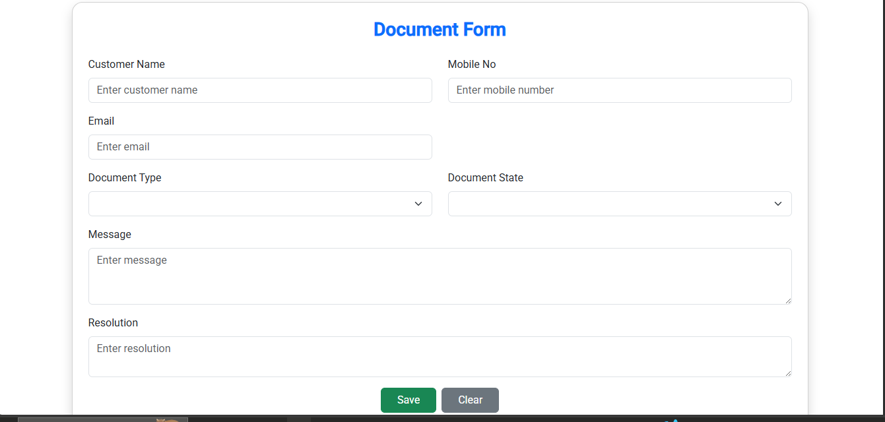

<<<<<<< HEAD
# DocumentAppUI

This project was generated using [Angular CLI](https://github.com/angular/angular-cli) version 20.2.1.

## Development server

To start a local development server, run:

```bash
ng serve
```

Once the server is running, open your browser and navigate to `http://localhost:4200/`. The application will automatically reload whenever you modify any of the source files.

## Code scaffolding

Angular CLI includes powerful code scaffolding tools. To generate a new component, run:

```bash
ng generate component component-name
```

For a complete list of available schematics (such as `components`, `directives`, or `pipes`), run:

```bash
ng generate --help
```

## Building

To build the project run:

```bash
ng build
```

This will compile your project and store the build artifacts in the `dist/` directory. By default, the production build optimizes your application for performance and speed.

## Running unit tests

To execute unit tests with the [Karma](https://karma-runner.github.io) test runner, use the following command:

```bash
ng test
```

## Running end-to-end tests

For end-to-end (e2e) testing, run:

```bash
ng e2e
```

Angular CLI does not come with an end-to-end testing framework by default. You can choose one that suits your needs.

## Additional Resources

For more information on using the Angular CLI, including detailed command references, visit the [Angular CLI Overview and Command Reference](https://angular.dev/tools/cli) page.
=======
# 🧩 Document Management System

A full-stack CRUD web application built with **ASP.NET Core Web API** (Backend), **Angular** (Frontend), and **SQL Server** (Database).  
This project allows users to **create, view, edit, and delete** document records efficiently through a clean user interface.

---

## 🚀 Features
- ✏️ Create new document records  
- 📄 View all existing documents  
- 🛠️ Edit and update document details  
- 🗑️ Delete documents permanently  
- 💾 Data stored in SQL Server using Entity Framework Core  
- 💎 Responsive and modern UI with Bootstrap 5  

---

## 🏗️ Technologies Used

| Layer | Technology |
|-------|-------------|
| **Frontend** | Angular 17, Bootstrap 5 |
| **Backend** | ASP.NET Core Web API (.NET 6/7/8) |
| **Database** | Microsoft SQL Server |
| **Tools** | Visual Studio, VS Code, Postman |

---

## ⚙️ CRUD Operations Overview

| Operation | Description |
|------------|-------------|
| **Create** | Add new document records |
| **Read** | Display all documents in a list or card view |
| **Update** | Edit existing document information |
| **Delete** | Remove records from the database |

---

## 🧠 Project Architecture

---

## 🖼️ Screenshots

### 🏠 Home Page


### ➕ Create Page


### ✏️ Edit Page


> 💡 **Tip:** Keep your screenshots inside a folder named `screenshots` in your project root.  
> Example:
> ```
> screenshots/
> ├── Home.png
> ├── Create.png
> ├── Edit.png
> ```

---

## 🧰 Setup Instructions

### 🔹 Backend Setup
1. Open the `.sln` file in **Visual Studio**  
2. Update the **connection string** inside `appsettings.json`  
3. Run migrations (if needed)  
4. Start the API using `Ctrl + F5`

### 🔹 Frontend Setup
1. Open terminal and navigate to the Angular project folder  
   ```bash
   cd ClientApp
2.Install dependencies
npm install
2. Run the Angular app
ng serve
Open browser → http://localhost:4200
>>>>>>> a6c173a4381babb43198329c0635b07aafde8bea
